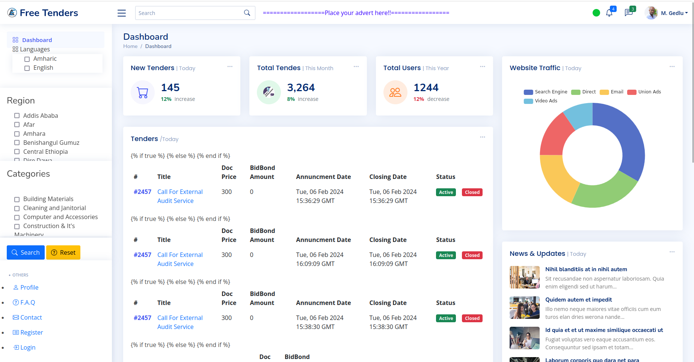

# Free Tenders AddisERP

## Introduction

Welcome to Free Tenders AddisERP – Your Seamless Tender Management Platform!

This project simplifies the process of finding and applying for tenders. Connect with businesses and discover opportunities effortlessly with our user-friendly platform.

- **Project Blog Article:**
  - [Read our Blog](http://web-01.addiserp.tech/about)

### Team Members

- **Natnael Gedlu:**
  - [LinkedIn](https://www.linkedin.com/in/natnael-gedlu-26a279293/)
  - [GitHub](https://github.com/Natnael-Gedlu)

- **Mikias Gedlu:**
  - [LinkedIn](https://www.linkedin.com/in/mikias-gedlu-53954a1b8/)
  - [GitHub](https://github.com/addiserp)

## Installation

To run this project locally, follow these steps:

1. Clone the repository:

   git clone https://github.com/addiserp/free.addiserp.git
   
2. Navigate to the project directory:

   cd free-tenders-addiserp

3. Install dependencies:

   pip install -r requirements.txt

4. Run the application:

   python main.py

## Usage

Explore opportunities, connect with businesses, and stay updated on the latest tenders in your area. Visit the live site here to experience the platform.
Contributing

We welcome contributions! If you'd like to contribute, please follow our Contribution Guidelines.
Related Projects

    https://github.com/addiserp/AirBnB_clone_v4.git

## Licensing

This project is licensed under the MIT License.

## Screenshots

